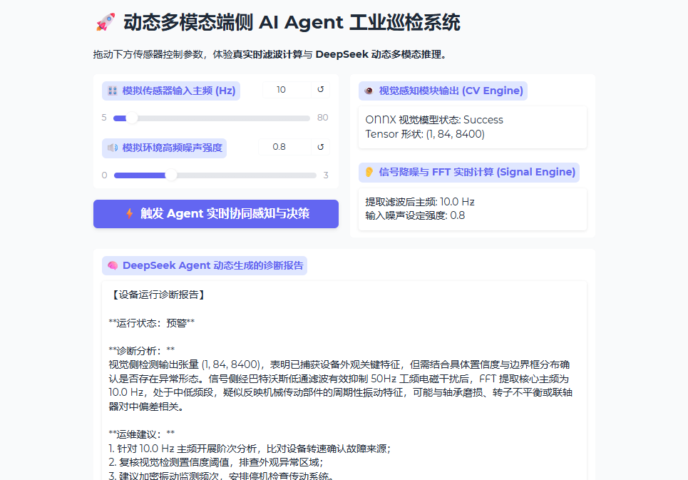

# 🚀 多模态端侧 AI Agent 工业巡检系统


基于 **YOLOv8/ONNX** 视觉推理 + **SciPy/FFT** 频域信号降噪 + **DeepSeek API** 决策中枢的模块化端侧巡检 Agent。

## 🌟 系统核心架构
- **端侧视觉引擎 (Vision Engine)**：基于 ONNX Runtime 实现毫秒级轻量化推理，脱离重型 PyTorch 依赖。
- **信号处理引擎 (Signal Engine)**：通过巴特沃斯低通滤波器切除工频干扰，并利用 FFT 快速傅里叶变换提取精准频域主频。
- **Agent 决策中枢 (LLM Decision)**：融合异构多模态特征，调用 DeepSeek 大模型生成结构化工业诊断报告。
- **动态控制面板 (Web UI)**：基于 Gradio 搭建，支持在线实时调参及诊断呈现。

## 🛠️ 快速启动

1. 克隆项目与安装依赖：
   ```bash
   pip install gradio scipy onnxruntime numpy requests python-dotenv